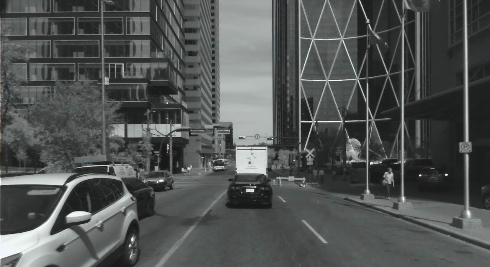
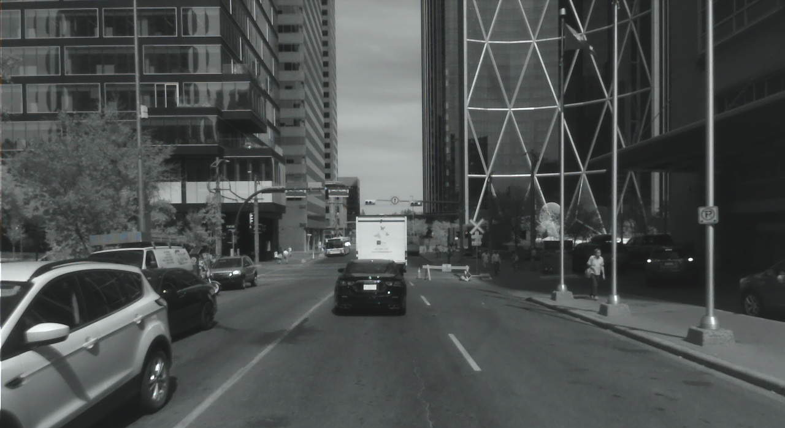
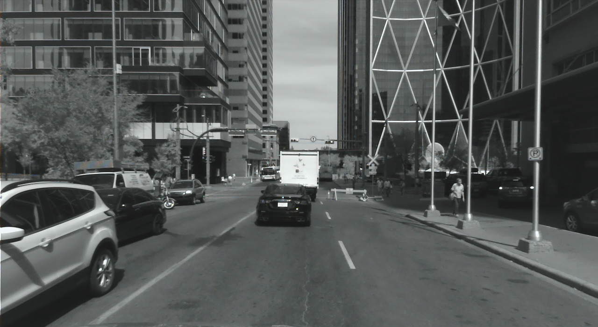
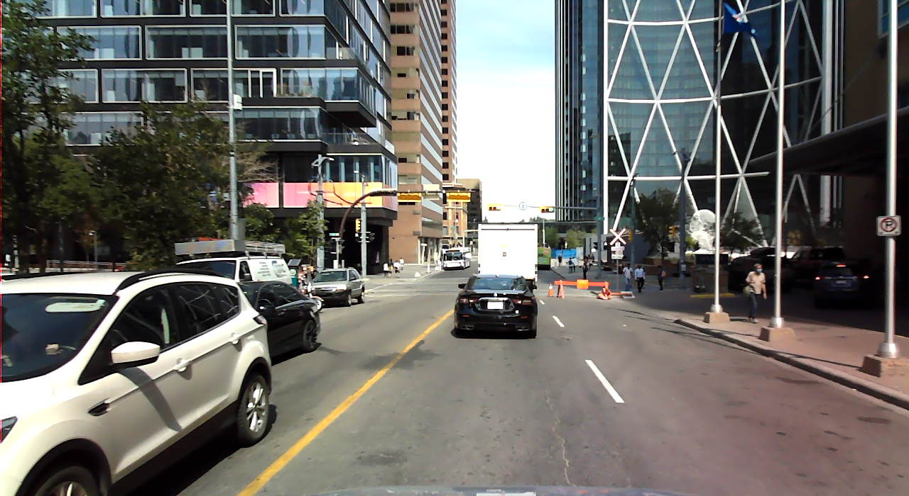
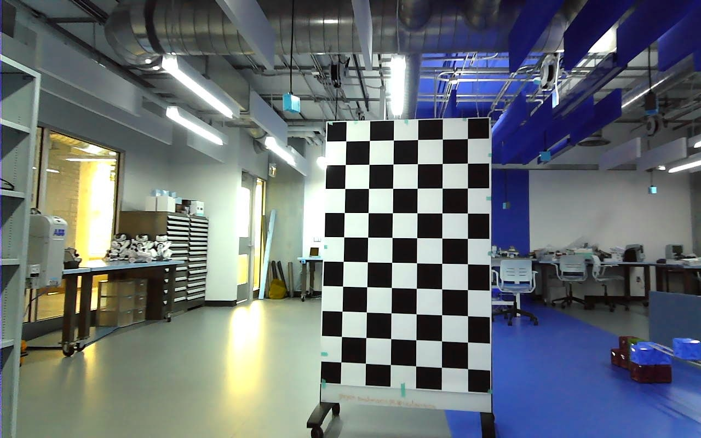

  
  
  
  
 

# StereoDataRecorder
 
The stereo camera setup featured three monochrome global shutter cameras (Cameras 1, 3, and 4) positioned 450mm apart, resulting in a total baseline of approximately 900mm (see Fig. A.1). Additionally, a global shutter color camera (Camera 2) was mounted near the middle camera to capture color data. Each camera had a 1 MP resolution with an image size of 1280 × 800 pixels. Data synchronization during recording was implemented to minimize any time lag between stereo images.

## Camera and IMU+GPS setup

The camera system was securely mounted on a vehicle using a robust metal square bar, further reinforced with a thick carbon fiber tube to maintain stability during movement. The metal bar was affixed to the vehicle's roof rails to ensure a rigid structure.

  
  

## Recording software 

The recording platform utilized an Intel NUC-8iBEH1 with an eight-core Intel® Core™ i7-8809G processor, paired with Radeon™ RX Vega M GH graphics and a 1TB NVMe SSD for data storage. The system ran on Ubuntu 18.04 LTS Linux (64-bit).

A custom recording software was developed with seven parallel threads, allocating four for cameras, one for IMU+GPS, one for synchronization, and the remaining for the OpenGL-based graphical user interface (GUI). Parallel threads synchronized and encoded images into lossless BMP files. Recorded
images were rectified and cropped to focus on pertinent regions. Post-rectification, image dimensions were standardized to 1228 × 400.

  

Images for camera calibration were collected in a controlled lab environment using checkerboard patterns. The calibration process was performed offline with tools developed in MATLAB. The figure provides a sample image from the calibration process.

  

